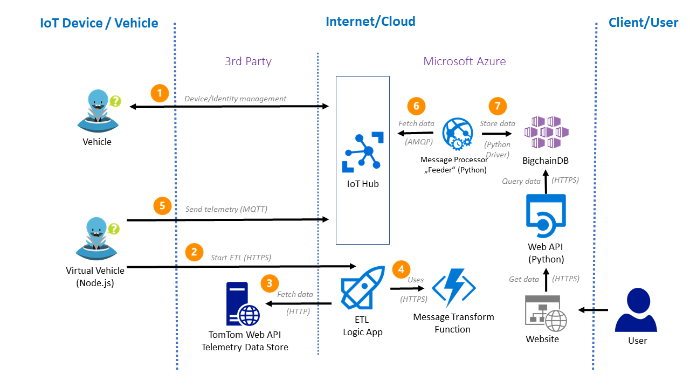
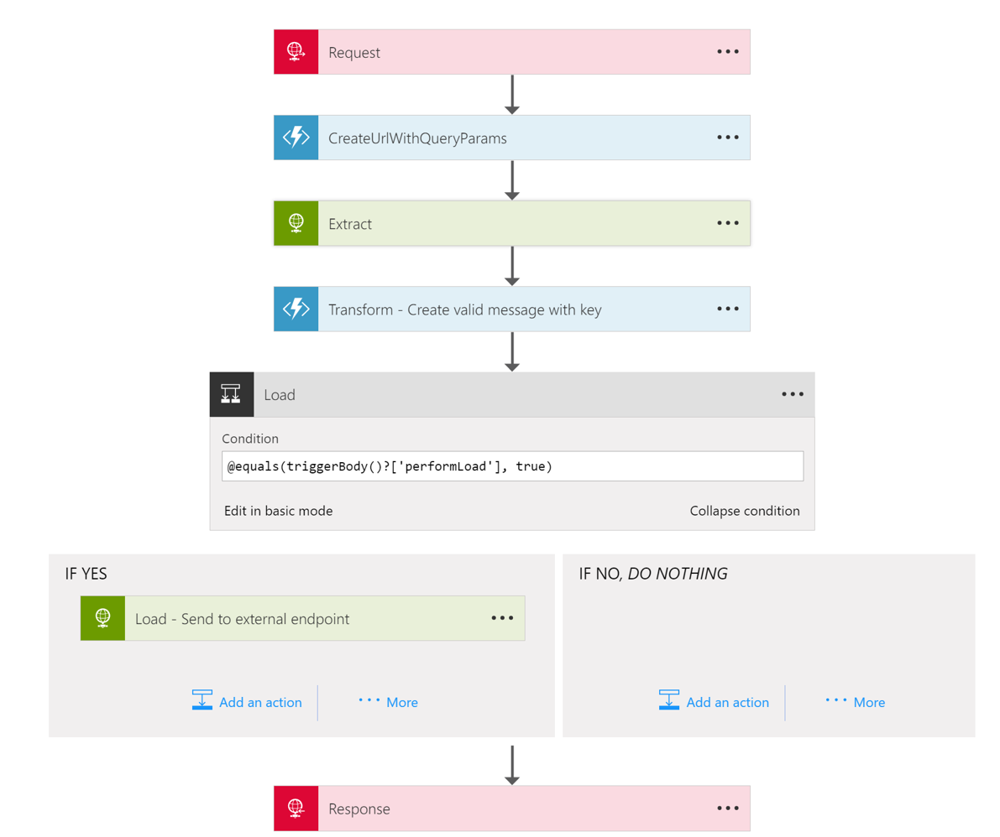

# IoT-hackfest-berlin-2017
Code for the IoT+ BigchainDb + MSFT + VW PoC at the hackfest in Berlin held from 28 Feb to 03 Mar 2017


## Steps to deploy the PoC
```
NOTE: You may have to use different the public and private keys than those 
used below.
```

#### Run RethinkDB
```
docker run \
--detach \
--name=rethinkdb \
--publish=172.17.0.1:28015:28015 \
--publish=172.17.0.1:8080:8080 \
--restart=always \
--volume "$HOME/bigchaindb_docker:/data" \
rethinkdb:2.3
```
To check the logs: `docker logs -f rethinkdb`


#### Configure BigchainDB to use the RethinkDB backend
Note: You do not need to do this step if you have done this already

```
docker run \
--interactive \
--rm \
--tty \
--volume "$HOME/bigchaindb_docker:/data" \
bigchaindb/bigchaindb \
-y configure \
rethinkdb
```
Change the `database.host` param in `~/bigchaindb_docker/.bigchaindb` file 
from `localhost` to `172.17.0.1`


#### Run BigchainDB
```
docker run \
--detach \
--name=bigchaindb \
--publish=172.17.0.1:9984:9984 \
--restart=always \
--volume=$HOME/bigchaindb_docker:/data \
bigchaindb/bigchaindb \
start
```
To check the logs: `docker logs -f bigchaindb`


#### Build and run nginx
```
cd IoT-hackfest-berlin-2017/bdb-web-api/nginx
docker build -t bdb-nginx .
docker run \
--detach \
--name=bdb-nginx \
--publish=80:80 \
--restart=always \
bdb-nginx
```
To check the logs: `docker logs -f bdb-nginx`


#### (Optional) Add the Lungo Tavolo products to bigchaindb
```
cd IoT-hackfest-berlin-2017/bdb-web-api/lungo_tavolo
python3 lungo_tavolo.py \
--bdb-ip localhost \
--bdb-port 80 \
--public-key F911cpKsZTP3Fxzx243mJqUh15CtGDTRuVBaw5xnvGXh \
--private-key 6H6g4c6fwc5MCDMT4cmTgDDuij9Yhr6FXVJ7G2sMoztJ \
--file ["Product Data Lungo Tavolo - Skirt.csv" |
        "Product Data Lungo Tavolo - Top.csv"   |
        "Product Data Lungo Tavolo - Pants.csv" ]
```
Note the transaction id for each product. We will need them later.


#### Run Lungo Tavolo UI
Use the transaction id in the code, as this is hardcoded for the PoC.
```
cd IoT-hackfest-berlin-2017/front-end/lt
docker build -t hackfest-lt .
docker run \
--detach \
--name=hackfest-lt \
--publish=172.17.0.1:8002:8002 \
--restart=always \
hackfest-lt
```
To check the logs: `docker logs -f hackfest-lt`


#### Run VW Fin Services UI
```
cd IoT-hackfest-berlin-2017/front-end/vw
docker build -t hackfest-vw .
docker run \
--detach \
--name=hackfest-vw \
--publish=172.17.0.1:8001:8001 \
--restart=always \
hackfest-vw
```
To check the logs: `docker logs -f hackfest-vw`


#### Run VW Front-End API Server
##### Microsoft module
```
cd IoT-hackfest-berlin-2017/vw-web-api
docker build -t vw-web-api .
docker run \
--detach \
--name=vw-web \
--publish=5000:5000 \
--restart=always \
vw-web-api
```

##### BigchainDB module - TODO(Krish/Thomas)
```
cd IoT-hackfest-berlin-2017/bdb-web-api/vw
docker build -t vw-backend-api .
docker run \
--detach \
--name=vw-backend-api \
--publish=5000:5000 \
--restart=always \
vw-web-api

```

#### Setup & run VW Financial Services IoT device infrastructure

The picture below shows a conception overview of the implemented IoT device infrastructure. It outlines the core components as well as how they interact which each other.



##### Setup the ETL process

This section explains how to setup the ETL process. It uses an Azure Logic App which itself calls two Azure Functions.

###### Create Azure Function '*CreateUrlWithQueryParams*'
1. On the Azure portal dashboard ([https://portal.azure.com](https://portal.azure.com "https://portal.azure.com")), select *New*.
2. In the search bar, search for '*function*', and then select *Function App*.
3. In the newly created Function App, create a new function named '*CreateUrlWithQueryParams*' using the '*HttpTrigger-CSharp*' template
4. Take the code from this repo (`etl-service\Function-CreateUrlWithQueryParams`) and replace the content of the files *run.csx* and *function.json*
5. When querying vehicle telemetry data from the TomTom service the correct credentials and keys have to be provided (replace placeholders)!
6. Test the function within the Azure portal (current window to see if everything is working)

###### Create Azure Function 'CreateSignedMessage'
1. In the Function App created in the previous step, create a new function named 'CreateSignedMessage' using the '*HttpTrigger-JavaScript*' template.
2. Take the code from this repo (`etl-service\Function-CreateSignedMessage`) and replace the content of the files *index.js*, *function.json* and *package.json*
3. Test the function within the Azure portal (current window to see if everything is working)

###### Create the Azrue Logic App (TomTom service data connector)

1. On the Azure portal dashboard ([https://portal.azure.com](https://portal.azure.com "https://portal.azure.com")), select *New*.
2. In the search bar, search for '*logic app*', and then select *Logic App*.
3. Enter a name for your logic app, select a location, resource group, and select *Create*.
4. After opening your logic app for the first time you can select from a template to start. Click *Blank Logic App* to build this from scratch.
5. Navigate to its *Code View* and paste the code from the repository. Make sure you replace all the relevant places and link your Azure functions.

Here is a designer representation of the Logic App and the different steps:



##### Create an Azure IoT Hub and connect IoT devices (virtual vehicle)

In order to be able to simulate devices (vehicles) an secure IoT infrastructure is required. Azure's IoT Hub provides the required functionalities: device management and ingest point for device data.

This section explains how to create a new Azure IoT Hub instance and a virtual vehicle (Node.js application) which sends telemtry data to the IoT Hub.

###### Create the IoT Hub
1. On the Azure portal dashboard ([https://portal.azure.com](https://portal.azure.com "https://portal.azure.com")), select *New*.
2. In the search bar, search for '*iot hub*', and then select *IoT Hub*. Make sure you use the free tier to avoid costs.

###### Create a new device (virtual vehicle) and connect it with the IoT Hub
1. Install the lastest IoT Hub Explorer tool using NPM
```
npm install -g iothub-explorer
```
2. Login to your IoT Hub instance and create/register a new device
```
iothub-explorer login <<IOT-HUB-CONNECTIONSTRING>>
iothub-explorer create <<DEVICE-ID e.g. mydevice01>> --connection-string
```
3. Write down the device's connection string (is the output of the last command) and use this in the *iot-virtual-vehicle* Node.js application (is in this repository `iot-virtual-vehicle`).
4. The current implementation calls the ETL Logic App. If needed ensure that you'll provide the correct HTTP URL (externally callable) of your Logic App created above.
5. Run the *iot-virtual-vehicle* Node.js application


##### 

# TODO:
python3 rest_api.py \
--bdb-ip localhost \
--bdb-port 9984 \
--public-key F911cpKsZTP3Fxzx243mJqUh15CtGDTRuVBaw5xnvGXh \
--private-key 6H6g4c6fwc5MCDMT4cmTgDDuij9Yhr6FXVJ7G2sMoztJ

groupadd -r mongodb && useradd -r -g mongodb mongodb
docker run \
--detach \
--name=mongodb \
--publish=172.17.0.1:27017:27017 \
--restart=always \
--volume=/tmp/mongodb_docker/db:/data/db \
--volume=/tmp/mongodb_docker/configdb:/data/configdb \
mongo:3.4.1 \
--replSet=bigchain-rs


curl -X POST \
  -H "Content-Type: application/json" \
  --data "@test-telemetry-data.json" \
  http://bcdbhack.westeurope.cloudapp.azure.com:5000/telemetry

